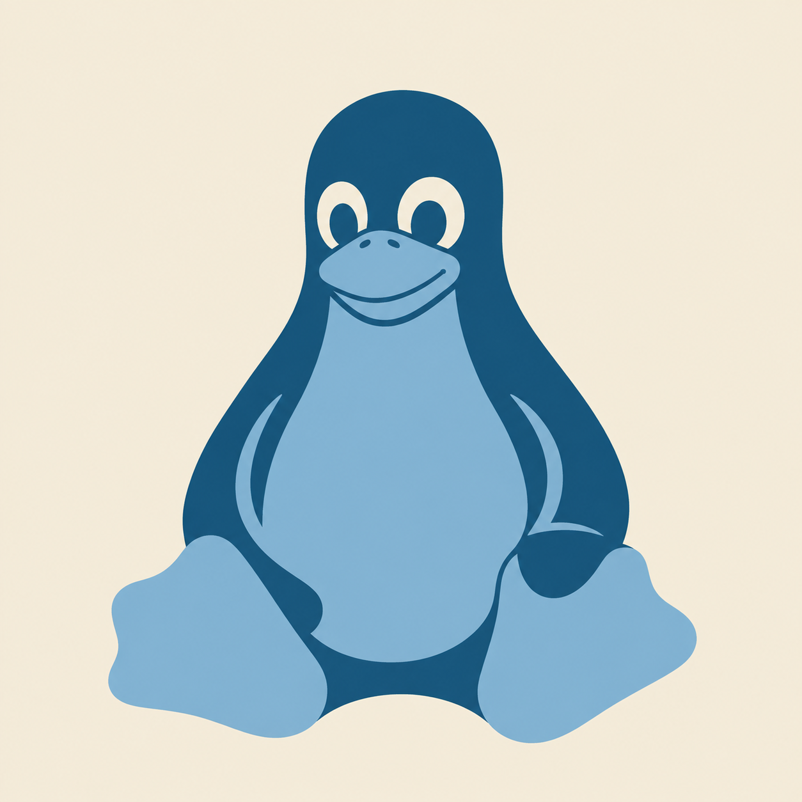

<div align="center">
  
  <h1>نواة · Nawah</h1>
  <p><strong>لينكس كامل بسطح مكتب رسومي على جوالك — تطبيق واحد، بلا روت، وبلا أي تطبيق مساعد.</strong></p>
  <p><em>A full Linux desktop on Android. One APK, no root, no Termux.</em></p>
</div>

---

## بالعربية

### ما هذا؟

تطبيق أندرويد واحد يثبّت **دبيان** ويشغّلها عبر `proot` (بلا صلاحية جذر)،
ويعرض سطح مكتب **XFCE 4** عبر خادم **X11** مدمج داخل التطبيق نفسه.

لا تحتاج Termux، ولا Termux:X11، ولا أي تطبيق آخر. تفتح التطبيق، تختار
التوزيعة وسطح المكتب والموارد والصلاحيات، تضغط "تثبيت"، ثم تضغط "تشغيل".

### ما الذي يعمل فعلًا

- تثبيت دبيان 12 أو 13، تُسحب صورتها من سجلّ الحاويات ويُتحقق من بصمتها أثناء التنزيل
- سطح مكتب XFCE 4 كامل يُرسم داخل التطبيق
- اللمس ولوحة المفاتيح والفأرة
- الصوت والميكروفون عبر PulseAudio
- الوصول إلى `/sdcard` داخل النظام
- أكثر من نظام بأسماء مختلفة، لكل واحد إعداداته

### ما الذي لا يعمل — وهذا مقصود قوله بصراحة

| ما قد تتوقعه | الحقيقة |
|---|---|
| **تحديد الذاكرة (RAM)** | مستحيل. `proot` بلا cgroups، وتحديد الذاكرة يحتاج صلاحية جذر. "ملف الموارد" في التطبيق يغيّر مجموعة الحزم ومؤثرات النوافذ ودقة الشاشة — أشياء تغيّر الاستهلاك فعلًا — ولا يدّعي حدًّا وهميًّا. |
| **تحديد المساحة** | الـ rootfs مجلد عادي لا صورة قرص. الأرقام المعروضة **تقدير وتحذير**، لا حصّة مفروضة. |
| **الكاميرا** | `/dev/video*` غير متاح لتطبيقات أندرويد أصلًا. غير ممكن. |
| **الأداء** | `proot` يعترض نداءات النظام عبر `ptrace`، وهذا يكلّف ~1.5–3× في الأحمال الثقيلة. XFCE على `llvmpipe` في جهاز متوسط ≈ 15–30 إطارًا/ث. |
| **متجر Google Play** | الرفض شبه مؤكد: التطبيق ينزّل كودًا وينفّذه (سابقة حذف Termux). التوزيع عبر GitHub Releases أو F-Droid أو APK مباشر. |

### المتطلبات

أندرويد 7 (API 24) فأحدث · معالج **arm64** · ‏3 جيجابايت مساحة حرة على الأقل ·
إنترنت عند التثبيت الأول (~50 ميجابايت للصورة، ثم حزم سطح المكتب)

### التثبيت

نزّل ملف APK من صفحة [Releases](../../releases) وثبّته. لا حاجة لأي شيء آخر.

---

## In English

### What it is

A single Android app that installs **Debian** and runs it under `proot` with no
root, then draws an **XFCE 4** desktop through an **X11** server embedded in the
app itself.

No Termux, no Termux:X11, nothing else to install. Open it, pick a
distribution, a desktop, resources and permissions, press Install, then Run.

### What actually works

Debian 12/13 install with a digest-verified system image · a full XFCE 4
desktop · touch, keyboard and mouse · audio and microphone via PulseAudio ·
`/sdcard` access · several named systems side by side.

### What does not, and why

- **RAM limits** — impossible. `proot` has no cgroups, and capping memory needs
  root. The resource profile changes the package set, compositing and
  resolution, which are things that genuinely change memory use. It does not
  pretend to enforce a limit.
- **Disk quotas** — the rootfs is a directory, not an image. The figures shown
  are estimates and warnings.
- **Camera** — `/dev/video*` is not exposed to Android apps at all.
- **Performance** — `proot` intercepts syscalls with `ptrace`, costing roughly
  1.5–3× on syscall-heavy work. XFCE on `llvmpipe` runs about 15–30 fps on a
  mid-range device.
- **Google Play** — almost certainly rejected: the app downloads and executes
  code, and Termux's own removal is the precedent. Distribute via GitHub
  Releases, F-Droid, or a direct APK.

### Requirements

Android 7 (API 24)+ · **arm64** · at least 3 GB free · internet for the first
install.

---

## How it works

```
┌───────────────────────── one APK ─────────────────────────┐
│                                                           │
│  Compose UI ──► SessionService ──► proot ──► Debian rootfs │
│                        │                         │        │
│                        ▼                         ▼        │
│              com.termux.x11.MainActivity   nawah-session   │
│                 (the lorie X server)       └─► nawah-x11   │
│                        ▲                         │        │
│                        └──── Binder + fd ◄────────┘        │
└───────────────────────────────────────────────────────────┘
```

The guest runs `/system/bin/app_process` from *inside* the container, which
loads a tiny APK we ship, which hands an X connection file descriptor back to
the app over Binder. `docs/x11-bridge.md` explains the whole handshake and the
two ways it fails.

| Module | What it is |
|---|---|
| `:app` | Compose M3 UI, services, orchestration |
| `:core` | model, device probe, proot runtime, install pipeline, OCI client |
| `:lorie` | the X server — vendored from termux-x11, unmodified |
| `:x11-loader` | upstream's `Loader.java`, built with our id and certificate |

## Building from source

```sh
git clone --recurse-submodules <this repo>
cd nawah
./gradlew :app:assembleDebug
```

`--recurse-submodules` is not optional: the X server is sixteen nested
submodules and the build fails confusingly without them. You also need
`bison`, `cmake`, `ninja` and `python3` on the build machine — the X server is
compiled from source.

```sh
./gradlew :core:test          # unit tests
python3 tools/native/verify.py  # bundled binary integrity
```

Note that a green build means "it compiles and its logic is correct", not "the
desktop works" — see `docs/testing.md`.

## Documentation

| | |
|---|---|
| [`docs/x11-bridge.md`](docs/x11-bridge.md) | how the desktop reaches the screen, and how it breaks |
| [`docs/native-binaries.md`](docs/native-binaries.md) | why executables are named `lib*.so` |
| [`docs/CONTRACTS.md`](docs/CONTRACTS.md) | the module contracts |
| [`docs/testing.md`](docs/testing.md) | what CI can and cannot prove |
| [`docs/device-testing-checklist.md`](docs/device-testing-checklist.md) | the on-device test pass |
| [`docs/adding-a-distro.md`](docs/adding-a-distro.md) | adding Ubuntu, Arch, KDE, LXQt |
| [`docs/release.md`](docs/release.md) | signing and publishing |

## Credit

The hard parts of this are not ours. **proot**, the Android package builds, and
the **lorie** X server are the work of the [Termux](https://github.com/termux)
project and its contributors — years of it. This app integrates that work; it
did not invent it.

## Licence

GPL-3.0. See [`LICENSE`](LICENSE) and [`NOTICE`](NOTICE) — the licence follows
from the components bundled, it is not a preference.
